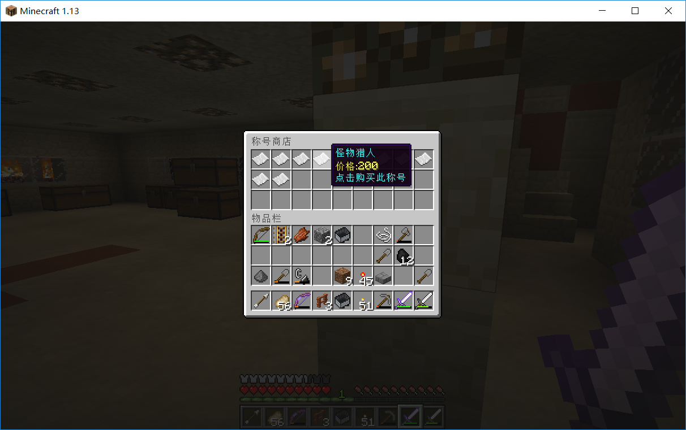

# Minecraft Plugin Prefix Shop
minecraft plugin prefix shop,我的世界 称号插件 商店。

## 使用 USE

&nbsp;&nbsp;&nbsp;&nbsp;插件基于[Prefix]插件：git地址[https://github.com/MountCloud/minecraft-plugin-prefix](https://github.com/MountCloud/minecraft-plugin-prefix "https://github.com/MountCloud/minecraft-plugin-prefix")。
[Prefix API]插件：git地址[https://github.com/MountCloud/minecraft-plugin-prefix-api](https://github.com/MountCloud/minecraft-plugin-prefix-api "https://github.com/MountCloud/minecraft-plugin-prefix-api")与Vault插件。

&nbsp;&nbsp;&nbsp;&nbsp;The plugin is based on the [Prefix] plugin: git address [https://github.com/MountCloud/minecraft-plugin-prefix](https://github.com/MountCloud/minecraft-plugin-prefix "https://github.com/MountCloud/minecraft-plugin-prefix").
[Prefix API] plugin: git address [https://github.com/MountCloud/minecraft-plugin-prefix-api](https://github.com/MountCloud/minecraft-plugin-prefix-api "https://github.com/MountCloud/minecraft-plugin-prefix-api") And the Vault plugin.

	/prefixshop 打开商城界面
	/prefixshop open 打开商城界面
	/prefixshop help 显示称号商城帮助

